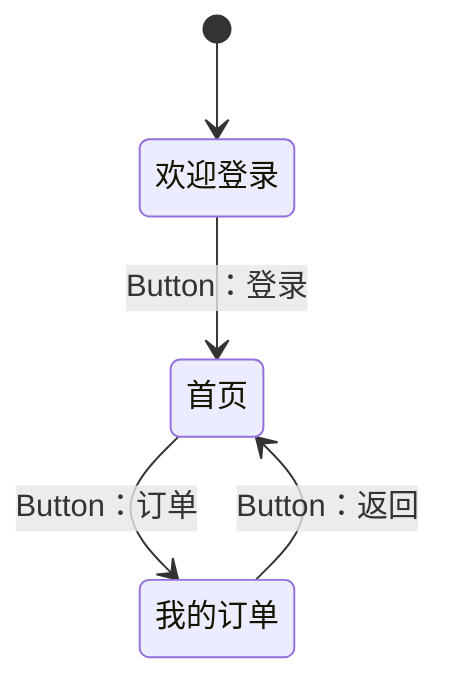

# 面向 OpenHarmony 的多模态智能测试系统

> 代码实现：**ohauto** —— OpenHarmony 应用 UI 自动化能力层
> *（名字取自 **O**pen**H**armony + **Auto**mation）*
> 基于 hdc 命令行通路，**设备侧零部署**（不需要为被测应用打包任何测试 HAP）

把「人工读控件树写脚本、肉眼判断是否跑通」变成
**系统自己探索、自己生成用例、自己判断失败原因、自己沉淀回归集**。

```
采集（控件树 + 截图）→ 理解 → 定位 → 操作 → 断言 → 判定 → 沉淀
                                   ↓
                        失败时：自动归因 → 自动修复 → 重跑
```

**为什么叫「多模态」**：定位目标时同时用两个通道 ——
**控件树**（结构化布局信息，精确但受限于应用是否设置 id）+
**截图**（视觉语义，能覆盖 Canvas 绘制、无标识图标等控件树盲区）。
实测真机数据：**747 个节点里只有 24 个带 id（3.2%）** ——
这正是必须引入视觉通道的原因。

## 文档索引

| 想了解什么 | 看哪 |
|---|---|
| **系统设计**（技术路线、分层架构） | [`docs/系统设计.md`](docs/系统设计.md) |
| **折叠屏模拟器操作指南** | [`docs/指南-折叠屏模拟器.md`](docs/指南-折叠屏模拟器.md) |
| **结果信号采集说明**（崩溃 / 白屏 / 无响应） | [`docs/信号采集-说明.md`](docs/信号采集-说明.md) |

## 安装

```bash
# 方式一：直接用源码（推荐，无需安装）
python -c "import ohauto"          # 需在项目根目录

# 方式二：装成包，并拿到命令行工具
pip install .
ohauto-doctor                      # 环境自检
```

依赖：`Python >= 3.9` + `pyyaml>=6.0`（可选，缺失时 Action DSL 自动退化为 JSON）。

## 目录

- [文档索引](#文档索引)
- [为什么这么做](#为什么这么做)
- [能力一览](#能力一览)
- [快速开始](#快速开始)
- [分层架构](#分层架构)
- [核心用法](#核心用法)
- [Action DSL](#action-dsl)
- [自动探索](#自动探索)
- [结果信号采集](#结果信号采集)
- [安全策略](#安全策略)
- [测试](#测试)
- [质量门禁（CI）](#质量门禁ci)
- [接真机后的第一步](#接真机后的第一步)

---

## 为什么这么做

鸿蒙官方 UiTest 提供**两套通路**：

| | ArkTS API 通路 | **hdc 命令行通路（本项目采用）** |
|---|---|---|
| 依赖 | 测试 HAP + hypium + `uitest start-daemon` | **只需 hdc** |
| 部署 | 每个被测应用都要打包测试包 | **设备侧零部署** |
| 集成 CI | 重 | 轻，纯宿主脚本 |

命令行通路的能力已经够用：

```bash
hdc shell uitest dumpLayout -p /data/local/tmp/t.json   # 控件树（JSON）
hdc shell uitest screenCap  -p /data/local/tmp/s.png    # 截图
hdc shell uitest uiInput click 100 100                  # 注入操作
hdc shell uitest uiInput inputText 100 100 hello
hdc shell uitest uiInput swipe 10 10 200 200 500
hdc shell uitest uiInput keyEvent Back
```

关键点：**`uiInput` 全部基于坐标**。所以本项目的核心工作之一，就是建立
「控件树 JSON → 控件对象 → bounds 中心坐标 → 注入事件」这条转换链。

---

## 能力一览

| 能力 | 说明 |
|---|---|
| 语义定位 | 按 id / text / 正则 / 无障碍描述 / 类型 / 尺寸 / 相对位置（within）等多属性组合查找 |
| 稳健等待 | `waitFor` 轮询、`waitGone`、`waitIdle`（连续两次控件树一致判定界面稳定） |
| 操作注入 | tap / doubleTap / longPress / input / swipe / fling / drag / 方向滑 / 按键 |
| 断言 | `assert_exists` / `assert_gone` / `assert_text` |
| 全程留痕 | 每步记录动作、坐标、控件路径、耗时、截图，失败带诊断线索 |
| 声明式用例 | YAML/JSON 的 Action DSL，可生成、可审阅、可重放 |
| 自动探索 | 广度优先探索页面跳转，产出页面状态图（Mermaid）+ 回归用例 |
| 报告 | JSON / Markdown / HTML 三格式，HTML 带截图 |
| 多模态定位 | 控件树 + 视觉双通道融合，Provider 可插拔 |
| 模拟设备 | 无真机跑通全链路，可进 CI |

---

## 快速开始

### 1. 准备环境

```bash
# 方式 A：装 DevEco Studio（自带 SDK 与 hdc）
# 方式 B：只要 hdc —— 下载 OpenHarmony 公开 SDK（无需登录）
python ../tools/fetch_sdk.py

# 让 ohauto 找到 hdc（只写项目内一个 JSON）
python ../tools/configure_hdc.py
```

> **本项目不修改系统任何设置。** 不写注册表、不改 PATH、不动环境变量。
> 定位 hdc 的优先级：
> 1. 代码显式传参 `Hdc(hdc_path=...)`
> 2. 环境变量 `HDC_PATH`（仅当前进程有效）
> 3. 项目内 `hdc.config.json` ← `configure_hdc.py` 写的就是它
> 4. 系统 PATH（若 hdc 本来就在 PATH 中，什么都不用配）
> 5. 常见安装位置（DevEco Studio / OpenHarmony SDK 默认目录）
>
> 撤销只需删掉那个 JSON，或 `python ../tools/configure_hdc.py --clear`。

### 2. 自检

```bash
python doctor.py
python doctor.py --bundle com.example.app    # 额外检查应用能否拉起
```

它会依次检查 Python、hdc、设备连接、**uitest 命令行通路是否可用**（这一项决定技术路线）、截图与控件树能力。

### 3. 无真机先跑一遍

```bash
python examples/offline_demo.py
```

在模拟设备上跑完整链路，确认代码没问题。

### 4. 接上真机

```bash
python examples/dump_tree.py --bundle <包名>      # 第一步：核对真实控件树结构
python examples/smoke_test.py --bundle <包名>     # 第二步：最小闭环
python examples/run_case.py examples/cases/login.yaml --bundle <包名>
```

---

## 分层架构

```
L4  应用层   explorer.py   自动探索 / 页面状态图 / 用例生成
             report.py     JSON / Markdown / HTML 报告
L3  语义层   driver.py     Driver 门面：定位→操作→等待→断言→留痕
             action.py     Action DSL（YAML 中间表示）
             vision.py     多模态定位（可插拔 Provider）
L2  定位层   layout.py     控件树 JSON 解析（字段别名宽进）
             matcher.py    多属性匹配器（对齐 UiTest ON 语义）
L1  执行层   hdc.py        hdc 命令封装（超时/重试/文件拉取）
L0           hdc  ←→  OpenHarmony 真机
```

**分层的目的**：L1/L2 稳定且可单测，L3 的智能部分可替换，L4 随业务变化。
换模型、改用例格式、加报告模板都不会互相波及。

辅助模块：
- `signals.py` —— 结果信号采集（崩溃/白屏/无响应/无窗口的客观证据 + 置信度）
- `sim.py` —— 模拟设备，无真机跑通全链路（含崩溃/hilog 故障注入）
  - ⚠️ 截图默认 `screen_style='content'`（像素分散，模拟真机常态）。
    **要测白屏判据必须显式传 `screen_style='solid'`** —— 用纯色图当默认值会让
    干净场景恒报 `WHITE_SCREEN` 0.99。
- `devices.py` —— **设备形态档案**（跨形态测试的数据基础）
  - 数据源是 DevEco 的 `productConfig.json`（68 台设备 / 11 个类型）
  - 折叠屏展开成多条档案：展开 / 折叠 /（三折叠的）双屏中间态
  - 每个形态带分辨率 / DPI / 圆角 / **挖孔包围盒**（解析 SVG path）
  - 判定 helper：`rect_within_screen` / `rect_hits_cutout` /
    `center_hits_cutout` / `rect_overflows_parent`
  - ⚠️ `safe_area` 静态配置里**没有** —— `has_measured_safe_area=False` 时
    它等于整屏，语义是「还没测」不是「没有安全区」
  - ⚠️ `caveats` 非空的形态数据需实测复核（当前是 Mate XT 折叠态/双屏态）
  - 清单导出：`python tools/export_form_profiles.py`
    → `ohauto/devices/form_profiles.{json,md}`
- `tools/emulator_cli.py` —— **模拟器命令行封装**（不依赖 DevEco GUI）
  - 覆盖：`-license accept` / `-install` / `-create` / `-start` / `-stop` /
    **`-foldedState`（命令行切折叠态）** / `-uiLayout` / `-screenshot` /
    `-rotation` / `-power`
  - `FOLD_STATES` 表记录各设备类型支持的折叠态 ——
    **三折叠有 9 种**（single/double/triple + 6 种左右半折组合）
  - `accept` 带 `--yes` 硬保护：那是法律协议，不能误触
  - 用法：`python tools/emulator_cli.py status`
- `doctor.py` —— 环境自检

---

## 核心用法

```python
from ohauto import Driver, ON

with Driver(bundle='com.example.app', artifact_dir='./run') as d:
    d.start()                                  # 拉起（返回冷启动耗时）
    d.wait_for(ON.text('登录'))                 # 等页面就绪

    d.input(ON.id('username'), 'alice')        # 定位 + 聚焦 + 输入
    d.input(ON.id('password'), 'secret')
    d.tap(ON.text('登录'))                      # 自动算中心坐标并点击

    d.assert_exists(ON.text('首页'))            # 断言跳转成功
    d.screenshot('home.png')

    print(d.summary())
    # {'steps_total': 5, 'steps_failed': 0, 'success_rate': 1.0, ...}
```

匹配器可以任意组合：

```python
ON.text('提交')                                  # 精确文本
ON.text_contains('确定')                         # 包含
ON.text_matches(r'^第\d+页$')                    # 正则
ON.id('btn_login')                              # 控件 id
ON.type('Button').clickable(True)               # 组合属性
ON.descr('微信快捷登录')                          # 无障碍描述
ON.size_at_least(44, 44)                        # 触控热区达标
ON.text('提交').within(ON.type('Scroll'))        # 限定在滚动容器内查找
ON.type('ListItem').nth(2)                      # 取第 3 个
```

---

## Action DSL

用 YAML 描述用例。选 YAML 是因为它同时满足三个角色：**机器可生成、人可审阅、回归可重放**。

```yaml
name: 登录流程
bundle: com.example.app
steps:
  - start: true
  - waitFor:   { text: "登录", timeout: 8000 }
  - input:     { id: "username", value: "alice" }
  - input:     { id: "password", value: "secret" }
  - tap:       { id: "btn_login" }
  - assert:    { exists: { text: "首页", timeout: 10000 } }
  - screenshot: "after_login.png"
  - swipe:     { direction: up, scale: 0.6 }
  - assert:    { gone: { text: "加载中" } }
  - back: true
```

支持的动作：`start` `stop` `tap` `tap_xy` `doubleTap` `longPress` `input`
`swipe` `fling` `waitFor` `waitGone` `waitIdle` `assert` `screenshot` `back` `home` `key`

支持的断言：`{exists: ...}` `{gone: ...}` `{text: {..., equals: "..."}}` `{visible: ...}`

```python
from ohauto import action, report
from ohauto.driver import Driver

case = action.load_case('examples/cases/login.yaml')
with Driver(bundle='com.example.app') as d:
    rep = action.run_case(d, case)
    print(rep.ok, rep.passed, rep.total)

    report.write_all(report.collect(d, run_report=rep), './out')
```

**留痕反推脚本** —— 人工或模型驱动一次操作，轨迹直接沉淀成可重放用例：

```python
steps = action.trace_to_steps(d)     # 从执行轨迹还原成 DSL 步骤
```

---

## 自动探索

让 Driver 自己点，摸出应用的页面跳转关系：

```python
from ohauto.explorer import Explorer

ex = Explorer(driver, artifact_dir='./explore')
graph = ex.explore(max_pages=8, max_actions_per_page=6, return_back=False)

print(ex.to_mermaid())          # 页面状态图
ex.save_graph('graph.json')     # 状态图 + 被跳过的控件
ex.generate_case('case.yaml')   # 把探索轨迹固化成可重放用例
```

输出示例：



---

## 结果信号采集

用例跑挂了，得知道**设备上到底发生了什么**。`collect_signals()` 采一次现场：

```python
from ohauto import collect_signals

sig = collect_signals(d.hdc, 'com.example.app', out_dir='./_out/signals')
sig.crashes              # [CrashRecord]，已按采集窗口 + bundle 过滤
sig.anomaly_score('CRASH')       # 合成置信度（同类证据概率组合，上限 0.99）
sig.warnings             # 每一步的降级说明
sig.to_json('signals.json')
```

采六类信号：**崩溃日志**（`faultlogger/`）、**进程存活**（`pidof`）、**截图**、**控件树**、
**hilog**（必须带 `-x`）、**设备时钟**。识别四类异常 —— 崩溃 / 白屏 / 无响应 / 无窗口 ——
每条都是「独立证据 + 来源 + 置信度」。

**它不做归因判断**，只给客观证据；下结论（「这是应用缺陷」）是下游归因引擎的事。

两个坑已经踩过并处理：

- **采集窗口锚在设备时钟域**。真机上设备 RTC 可能不准（实测卡在 2017 年），
  拿本机时间比会把所有崩溃判成「窗口外」。时钟回跳留下的旧日志（时间戳落在设备
  当前时间之后）会被识别并剔除。
- **`collect_signals()` 除参数错误外不抛异常**，任何一步失败都记 `warnings` 并降级。

无真机也能走通整条链路：

```bash
python examples/collect_signals.py --bundle com.ohos.note --sim   # 模拟设备注入一次崩溃
python examples/collect_signals.py --bundle com.ohos.note         # 真机
```

细节（每种异常的判据与置信度、未验证项）见 [`信号采集-说明.md`](docs/信号采集-说明.md)。

---

## 安全策略

**自动探索会真的点击 UI，这在真机上有风险。** 因此内置危险控件黑名单，
默认拦截含「删除 / 支付 / 退出登录 / 注销 / 卸载 / 重置」等语义的控件：

```python
from ohauto.explorer import Explorer, SafetyPolicy

# 默认：拦截危险控件
ex = Explorer(driver)

# 自定义策略
pol = SafetyPolicy(
    deny_patterns=[r'删除', r'支付', r'delete', r'pay'],
    max_text_len=30,
)
ex = Explorer(driver, policy=pol)

# 仅在明确知道后果时放开
pol = SafetyPolicy(allow_dangerous=True)
```

被跳过的控件会记录在状态图的 `skipped_controls` 里，便于人工复核。

---

## 测试

```bash
# 全部测试（无需真机）—— 589 项
python -m unittest discover -s tests -t tests -q

# 只跑核心逻辑单测
python -m unittest tests.test_core -v

# 只跑模拟设备集成测试
python -m unittest tests.test_integration_sim -v
```

覆盖范围（**589 项，全部不需要真机**）：

| 文件 | 覆盖 | 项数 |
|---|---|---:|
| `test_core.py` | Rect 坐标解析、控件树解析、匹配器、DSL、视觉融合、报告 | 96 |
| `test_signals.py` | 结果信号采集：崩溃/白屏/无响应/窗口异常/ANR 判据与置信度 | 104 |
| `test_runner.py` | 用例执行编排、重试、设备自愈 | 82 |
| `test_crossform.py` | ★ 跨形态差异比对（四类判据 + 真机夹具回归） | 92 |
| `test_emulator_cli.py` | 模拟器命令行封装：折叠态表、参数拼装、协议保护 | 58 |
| `test_devices.py` | 设备形态档案：挖孔 path 解析、多形态展开、安全区语义 | 56 |
| `test_integration_sim.py` | 基于模拟设备的端到端：定位→操作→断言→探索→报告 | 47 |
| `test_sync_device_time.py` | 设备校时（`hwclock -u` 防回归） | 26 |
| `test_hdc_pull.py` | ★ `pull` 的路径规范化与二进制完整性 | 11 |

> ⚠️ 用 `-t tests` 指定 top-level 更稳（不加时部分环境会报
> `Start directory is not importable`）。

---

## 质量门禁（CI）

```bash
python tools/quality_gate.py            # 四道关卡全跑（约 100s）
python tools/quality_gate.py --fast     # 跳过覆盖率，本地快速自测
```

| # | 关卡 | 阻断条件 |
|---|---|---|
| 1 | 静态检查（`tools/static_check.py`，**零依赖**） | 有 error |
| 2 | 单元测试（589 项） | 任一失败 |
| 3 | 覆盖率（`.coveragerc` 的 `fail_under`） | < **70%** |
| 4 | 离线端到端（`examples/offline_demo.py`） | 非零退出 |

**实测覆盖率 85%**（核心包 `ohauto/`，4038 语句 / 611 未覆盖），
规划要求 ≥70%，留了 15 个百分点余量。

> 静态检查**不引 flake8/mypy** —— 项目红线是「只用标准库，不引入新依赖」，
> 所以用 `ast` 实现了类型注解、命名规范、危险模式等检查。
> 详见 本仓库「质量门禁（CI）」章节。

---

## 接真机后的第一步

各家 OpenHarmony 版本的 `dumpLayout` JSON 字段命名存在差异。本项目的解析器采取
**宽进**策略（多路字段别名兜底、bounds 兼容 JSON 字符串与对象两种形态），
但首次上真机仍建议核对一次：

```bash
python examples/dump_tree.py --bundle <包名>
```

它会：
1. 抓下真实控件树
2. 列出所有出现过的字段，标注哪些已被识别
3. 检查 `type` / `id` / `text` / `bounds` 是否都覆盖到
4. 尝试解析并报告有多少节点的 bounds 解析为 0（字段名不对的信号）
5. 打印控件树层级供人工核对

若发现未覆盖字段，按输出提示补进 `ohauto/layout.py` 的 `ATTR_ALIASES` 即可。

---

## 已知限制

| 限制 | 说明 |
|---|---|
| `uiInput` 基于坐标 | 坐标随折叠/旋转/滚动变化，**每次操作前必须重新 dumpLayout**，本项目已按此实现 |
| 控件树盲区 | Canvas 绘制、纯图标按钮在控件树里可能为空，需靠视觉通道补位 |
| 设备差异 | 不同 OH 版本 `uitest` 命令支持程度不同，`doctor.py` 会检出 |
| 防自动化应用 | 部分商业应用禁止截图/注入，建议以自研或开源示例应用为测试目标 |
| 需要开发者模式 | 真机必须开启「开发者模式 + USB 调试」并授权本机 |

---

## 依赖

- Python 3.9+
- `pyyaml`（可选；缺失时 DSL 自动退化为 JSON）
- `hdc`（来自 DevEco Studio 或 OpenHarmony SDK）
