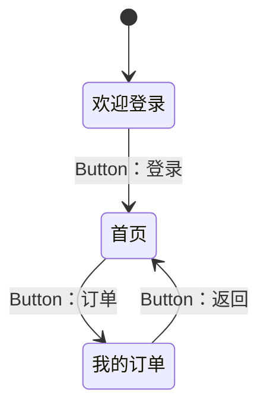

# ohauto —— 面向 OpenHarmony 的多模态智能测试系统

ohauto（OpenHarmony + Automation）是 OpenHarmony 应用 UI 自动化能力层。
它基于 hdc 命令行通路，设备侧零部署，不需要为被测应用打包任何测试 HAP。

系统将人工测试流程转化为自动流程：自动探索应用页面结构，自动生成可执行的测试用例，
自动执行与断言，失败时自动归因并修复定位，最终沉淀为可重放的回归集。

```
采集（控件树 + 截图）→ 理解 → 定位 → 操作 → 断言 → 判定 → 沉淀
                                   ↓
                        失败时：自动归因 → 自动修复 → 重跑
```

系统名称中的「多模态」指控件定位使用两个信息通道：控件树提供结构化布局信息，
精确定位受应用是否设置 id 限制；截图提供视觉语义，覆盖 Canvas 绘制、无标识图标等
控件树盲区。两个通道的证据按统一契约融合裁决。

单通道方案的不足有真机数据支撑：7 份控件树 / 6 个应用 / 800 个节点中，
仅 45 个节点带 id（5.62%），带 text 的 59 个（7.4%）；其中系统设置与纯 Canvas
绘制的时钟应用整棵树 id 数为 0，控件树通道在这类应用上完全失效。
复现命令：`python tools/profile_locators.py datasets/real_samples_20260919`。

## 文档索引

| 内容 | 位置 |
|---|---|
| 快速上手（本页） | 安装 → 快速开始 |
| API 手册（公共 API / 命令行工具 / 退出码约定 / 结果信号格式 / 常见操作要点） | [`docs/API手册.md`](docs/API手册.md) |
| 在线演示页（整链演示 / 应用画廊） | [`docs/demo/onepager.html`](docs/demo/onepager.html) · [`docs/demo/gallery.html`](docs/demo/gallery.html) |

## 核心特性

- 语义定位：按 id、文本、正则、无障碍描述、类型、尺寸、相对位置等属性组合查找控件
- 五级降级定位链：id 精确 → id 模糊 + 文案 → 父链类型路径 → 视觉 → 坐标兜底（记录告警）
- 自然语言生成用例：两阶段生成，静态校验拦截缺乏实质验证的用例，附修复轮
- 自动探索：广度优先遍历页面跳转，产出页面状态图与回归用例
- 失败归因：四分类（定位失败 / 应用缺陷 / 环境问题 / 用例问题），多源信号交叉印证
- 定位器自愈：连续失败触发重探索换代，五档线索逐级降级，含视觉换通道，验证不过则回滚
- 跨形态比对：折叠展开双态与多形态差异比对，四类差异判据，输出修复回归门禁
- 契约式多源融合：静态源码 / 控件树 / 视觉 / OCR 四源适配器，`Claim(kind,value,scope)` 契约，源不可用必须显式声明
- 结果信号采集：崩溃、白屏、无响应、无窗口四类异常的客观证据与置信度
- 模拟设备：无真机执行完整链路，可接入 CI

关键指标的实测值与口径：

| 指标 | 实测值 | 口径说明 |
|---|---|---|
| 控件 id 覆盖率（全节点 / 可交互控件） | 5.62% / 42.3% | 55.8% 的可交互控件无任何语义标识 |
| 视觉定位与控件树标注的一致性 | 95.0%（19/20），扩充至 13 应用后 97.8%（45/46） | 是双通道一致性（IoU@0.5），不是绝对准确率；项目未建人工真值标注集 |
| 自然语言生成用例静态可执行率 | 92.3%（24/26，两轮复跑一致） | 含 2 条固定负样本，均被校验闸正确拦截；可执行用例零空壳 |
| 生成用例真机执行 | 用例级 23/24 与 22/24（两轮并列） | 两轮波动 1 条，根因均为断言目标落在控件树之外 |
| 用例墙钟耗时（树复用优化后） | 降低 26%（取树 12 次 → 9 次） | 同一条 10 步用例的真机前后对比 |
| 视觉定位时延 | p50 约 1.1 秒 | 关闭思考模式，云端模型 |

## 安装

```bash
# 方式一：直接使用源码（推荐，无需安装）
python -c "import ohauto"          # 需在项目根目录

# 方式二：安装为包，获得命令行工具
pip install .
ohauto-doctor                      # 环境自检
```

依赖：Python 3.9 及以上；`pyyaml>=6.0`（可选，缺失时用例 DSL 自动退化为 JSON）；
`hdc`（来自 DevEco Studio 或 OpenHarmony 公开 SDK）。

## 快速开始

### 1. 准备 hdc

系统只需要一个可用的 `hdc`（HarmonyOS Device Connector），DevEco Studio 自带的即可。
定位 hdc 的优先级如下，通常无需任何配置：

1. 代码显式传参 `Hdc(hdc_path=...)`
2. 环境变量 `HDC_PATH`
3. 项目内 `hdc.config.json` 或 `.ohauto.json`（向上逐级查找，也查 `~/.ohauto/`）
4. 系统 PATH
5. DevEco Studio 与 OpenHarmony SDK 的常见安装位置

本项目不修改系统设置：不写注册表、不改 PATH、不安装驱动。

### 2. 环境自检

```bash
python doctor.py
python doctor.py --bundle com.example.app    # 额外检查应用能否启动
```

自检依次覆盖 Python、hdc、设备连接、uitest 命令行通路（该通路决定技术路线）、
截图与控件树能力。

### 3. 无真机验证

```bash
python examples/offline_demo.py
```

在模拟设备上执行完整链路，用于确认环境与代码可用。

### 4. 连接真机

```bash
python examples/dump_tree.py --bundle <包名>      # 核对真实控件树结构
python examples/smoke_test.py --bundle <包名>     # 最小闭环
python examples/run_case.py examples/cases/calculator.yaml   # 执行示例用例
```

`examples/cases/login.yaml` 是语法示例模板，其 bundle 为不存在的 `com.example.app`，
不可用于真机；执行用例请使用指向设备自带计算器的 `calculator.yaml`。

## 分层架构

```
L4  应用层   explorer.py   自动探索 / 页面状态图 / 用例生成
             diagnose.py   失败归因四分类（信号交叉印证）
             generator.py  自然语言 → 用例（两阶段，多页上下文）
             signals.py    结果信号采集（CRASH / WHITE_SCREEN / NO_RESPONSE / NO_WINDOW）
             report.py     JSON / Markdown / HTML 报告
L3  语义层   driver.py     Driver 门面：定位→操作→等待→断言→留痕
             action.py     Action DSL（YAML 中间表示）
             vision.py     多模态定位（可插拔 Provider）
L2  定位层   layout.py     控件树 JSON 解析（字段别名宽进）
             matcher.py    多属性匹配器（对齐 UiTest ON 语义）
             treesum.py    控件树摘要（供模型的紧凑表示）
L1  执行层   hdc.py        hdc 命令封装（超时 / 重试 / 文件拉取）
L0           hdc  ←→  OpenHarmony 设备
```

跨层专项模块：

- `locator.py`：定位器健康账本与自愈换代，五档线索选人，视觉换通道，快照回滚
- `fusion.py`：N 源契约融合，`Claim(kind,value,scope)` 契约，源不可用显式声明
- `crossform.py` / `crossform_report.py`：跨形态差异比对与报告
- `devices.py`：设备形态档案，数据源为 DevEco `productConfig.json`
  （68 台设备 / 11 个类型），折叠屏展开为多条形态档，含分辨率、DPI、圆角与挖孔包围盒
- `sim.py`：模拟设备，支持崩溃与 hilog 故障注入
- `tools/emulator_cli.py`：模拟器命令行封装，覆盖安装、创建、启动、
  折叠态切换、截屏与旋转，不依赖 DevEco 图形界面

分层的意义：L1/L2 稳定可单测，L3 的智能部分可替换，L4 随需求演进；
更换模型、调整用例格式、新增报告模板互不影响。

关于技术路线：OpenHarmony 官方 UiTest 提供 ArkTS API 与 hdc 命令行两条通路。
ArkTS 通路要求每个被测应用打包测试 HAP；hdc 命令行通路只需 hdc 本身，
设备侧零部署，CI 集成成本低，本系统采用后者。
`uitest` 命令提供控件树、截图与坐标注入能力，系统在此之上建立
「控件树 JSON → 控件对象 → bounds 中心坐标 → 注入事件」的转换链。

## 核心用法

```python
from ohauto import Driver, ON

with Driver(bundle='com.example.app', artifact_dir='./run') as d:
    d.start()                                  # 启动应用（返回冷启动耗时）
    d.wait_for(ON.text('登录'))                 # 等待页面就绪

    d.input(ON.id('username'), 'alice')        # 定位 + 聚焦 + 输入
    d.input(ON.id('password'), 'secret')
    d.tap(ON.text('登录'))                      # 计算中心坐标并点击

    d.assert_exists(ON.text('首页'))            # 断言跳转成功
    d.screenshot('home.png')

    print(d.summary())
    # {'steps_total': 5, 'steps_failed': 0, 'success_rate': 1.0, ...}
```

匹配器支持任意组合：

```python
ON.text('提交')                                  # 精确文本
ON.text_contains('确定')                         # 包含
ON.text_matches(r'^第\d+页$')                    # 正则
ON.id('btn_login')                              # 控件 id
ON.type('Button').clickable(True)               # 组合属性
ON.descr('微信快捷登录')                          # 无障碍描述
ON.size_at_least(44, 44)                        # 触控热区达标
ON.text('提交').within(ON.type('Scroll'))        # 限定在滚动容器内查找
ON.type('ListItem').nth(2)                      # 取第 3 个
```

## 用例 DSL

用例以 YAML 描述，机器可生成、人工可审阅、回归可重放：

```yaml
name: 登录流程
bundle: com.example.app
steps:
  - start: true
  - waitFor:   { text: "登录", timeout: 8000 }
  - input:     { id: "username", value: "alice" }
  - input:     { id: "password", value: "secret" }
  - tap:       { id: "btn_login" }
  - assert:    { exists: { text: "首页", timeout: 10000 } }
  - screenshot: "after_login.png"
  - swipe:     { direction: up, scale: 0.6 }
  - assert:    { gone: { text: "加载中" } }
  - back: true
```

支持的动作：`start` `stop` `tap` `doubleTap` `longPress` `input` `swipe` `fling`
`waitFor` `waitGone` `waitIdle` `assert` `screenshot` `back` `home` `key`。
支持的断言：`exists`、`gone`、`text`（含 `equals`）、`visible`。

```python
from ohauto import action, report
from ohauto.driver import Driver

case = action.load_case('examples/cases/calculator.yaml')
with Driver(bundle='com.example.app') as d:
    rep = action.run_case(d, case)
    print(rep.ok, rep.passed, rep.total)
    report.write_all(report.collect(d, run_report=rep), './out')
```

人工或模型执行一次操作后，执行轨迹可沉淀为可重放用例：

```python
steps = action.trace_to_steps(d)     # 从执行轨迹还原 DSL 步骤
```

## 自动探索

```python
from ohauto.explorer import Explorer

ex = Explorer(driver, artifact_dir='./explore')
graph = ex.explore(8, Budget(max_pages=8, max_actions_per_page=6), return_back=False)

print(ex.to_mermaid())          # 页面状态图
ex.save_graph('graph.json')     # 状态图 + 被跳过的控件
ex.generate_case('case.yaml')   # 探索轨迹固化为可重放用例
```

输出示例：



## 结果信号采集

用例失败时，`collect_signals()` 采集一次设备现场：

```python
from ohauto import collect_signals

sig = collect_signals(d.hdc, 'com.example.app', out_dir='./out/signals')
sig.crashes                       # 崩溃记录列表，已按采集窗口与包名过滤
sig.anomaly_score('CRASH')        # 合成置信度（同类证据概率组合，上限 0.99）
sig.warnings                      # 各采集步骤的降级说明
sig.to_json('signals.json')
```

采集六类信号：崩溃日志（faultlogger）、进程存活（pidof）、截图、控件树、
hilog、设备时钟；识别崩溃、白屏、无响应、无窗口四类异常，
每条异常均为「独立证据 + 来源 + 置信度」。该接口只提供客观证据，
归因判断由下游 diagnose 模块完成。

两项实现要点：

- 采集窗口锚定设备时钟域。设备 RTC 可能不准确，与宿主机时间比对会产生误判；
  时间戳落在设备当前时间之后的旧日志（时钟回跳残留）会被识别并剔除。
- 除参数错误外该接口不抛异常，任何一步失败记录到 `warnings` 并降级。

无真机验证：

```bash
python examples/collect_signals.py --bundle com.ohos.note --sim   # 模拟设备注入一次崩溃
python examples/collect_signals.py --bundle com.ohos.note         # 真机
```

信号格式与判据详见 [API 手册](docs/API手册.md)。

## 安全策略

自动探索会真实点击界面，存在风险。系统内置危险控件黑名单，
默认拦截含删除、支付、退出登录、注销、卸载、重置等语义的控件：

```python
from ohauto.explorer import Explorer, SafetyPolicy

ex = Explorer(driver)                       # 默认策略：拦截危险控件

pol = SafetyPolicy(
    deny_patterns=[r'删除', r'支付', r'delete', r'pay'],
    max_text_len=30,
)
ex = Explorer(driver, policy=pol)           # 自定义策略

pol = SafetyPolicy(allow_dangerous=True)    # 明确知晓后果时放开
```

被跳过的控件记录在状态图的 `skipped_controls` 字段中，供人工复核。

## 测试

```bash
# 全部测试（无需真机）
python -m unittest discover -s tests -t tests -q

# 只跑核心逻辑单测
python -m unittest tests.test_core -v

# 只跑模拟设备集成测试
python -m unittest tests.test_integration_sim -v
```

共 1384 项测试 / 45 个测试文件，全部不依赖真机。测试策略：每个修复对应一个
回归测试钉子，钉子只增不减；真机采集的控件树与截图作为离线夹具进入测试，
使全部逻辑可在无设备环境复现。核心测试文件：

| 文件 | 覆盖 | 项数 |
|---|---|---:|
| `test_core.py` | 坐标解析、控件树解析、匹配器、DSL、视觉融合、报告 | 96 |
| `test_signals.py` | 信号采集：崩溃 / 白屏 / 无响应 / 窗口异常判据与置信度 | 104 |
| `test_runner.py` | 执行编排、重试、设备自愈、取树记账 | 100 |
| `test_crossform.py` | 跨形态差异比对（四类判据 + 真机夹具回归） | 92 |
| `test_emulator_cli.py` | 模拟器命令行封装：折叠态表、参数拼装、协议保护 | 58 |
| `test_devices.py` | 设备形态档案：挖孔解析、多形态展开、安全区语义 | 56 |
| `test_integration_sim.py` | 模拟设备端到端：定位→操作→断言→探索→报告 | 47 |
| `test_sync_device_time.py` | 设备校时 | 26 |
| `test_hdc_pull.py` | 文件拉取的路径规范化与二进制完整性 | 11 |

## 质量门禁（CI）

```bash
python tools/quality_gate.py            # 四道关卡全跑（约 3 分钟）
python tools/quality_gate.py --fast     # 跳过覆盖率，本地快速自测
```

| 关卡 | 内容 | 阻断条件 |
|---|---|---|
| 1 | 静态检查（`tools/static_check.py`，仅标准库实现） | 存在 error |
| 2 | 单元测试（1384 项） | 任一失败 |
| 3 | 覆盖率 | 低于 70% |
| 4 | 离线端到端（`examples/offline_demo.py`） | 非零退出 |

当前实测覆盖率 91%（7958 语句 / 747 未覆盖，核心包 `ohauto/`），
门禁线 70%。静态检查不引入 flake8 / mypy 等外部依赖，
基于 `ast` 实现类型注解、命名规范与危险模式检查，符合「仅标准库」的依赖约束。

## 连接新设备的第一个步骤

不同 OpenHarmony 版本的 `dumpLayout` JSON 字段命名存在差异。解析器采取宽进策略
（多路字段别名兜底，bounds 兼容字符串与对象两种形态），首次连接新设备时建议核对一次：

```bash
python examples/dump_tree.py --bundle <包名>
```

该命令抓取真实控件树，列出全部出现过的字段并标注识别情况，检查 `type` / `id` /
`text` / `bounds` 覆盖度，报告 bounds 解析为零的节点数（字段名不匹配的信号），
并打印树层级供人工核对。发现未覆盖字段时，按输出提示补充
`ohauto/layout.py` 的 `ATTR_ALIASES`。

## 已知限制

| 限制 | 说明 |
|---|---|
| `uiInput` 基于坐标 | 坐标随折叠、旋转、滚动变化，每次操作前必须重新获取控件树，系统已按此实现 |
| 控件树盲区 | Canvas 绘制、纯图标按钮在控件树中可能没有信息，需视觉通道补位 |
| 设备差异 | 不同 OpenHarmony 版本的 `uitest` 命令支持程度不同，`doctor.py` 可检出 |
| 防自动化应用 | 部分商业应用禁止截图与注入，建议以自研或开源应用为测试目标 |
| 开发者模式 | 真机需开启开发者模式与 USB 调试并授权宿主机 |
| 平台范围 | 当前聚焦 OpenHarmony 生态；hdc 通道已隔离在独立封装层，可扩展其他平台 |

## 依赖

- Python 3.9+
- pyyaml（可选，缺失时 DSL 退化为 JSON）
- hdc（来自 DevEco Studio 或 OpenHarmony SDK）
